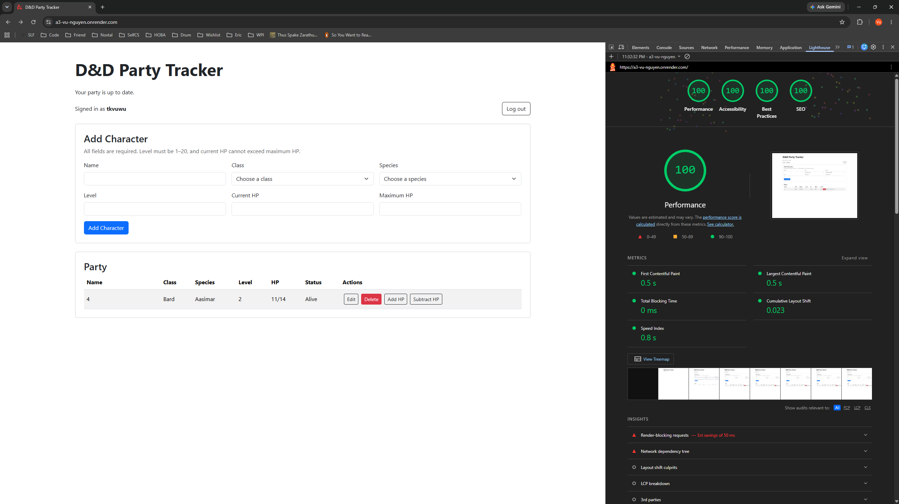

# D&D Party Tracker

[https://a3-vu-nguyen.onrender.com/login.html](https://a3-vu-nguyen.onrender.com/login.html)

D&D Party Tracker is a web app for managing a Dungeons & Dragons adventuring party. Users can create an account and add, view, edit, and delete their own characters. Character status is automatically calculated by the server based on current and maximum HP.

The app uses:
- Express for the server
- MongoDB Atlas to save accounts and characters between sessions. I chose username/password authentication since it's the first one I looked up. Passwords are hashed using `bcryptjs`, and login sessions are managed with `express-session` and stored in MongoDB using `connect-mongo`.
- Bootstrap because it's the most popular, added custom CSS for hidden elements, wrapping long character names, setting table-cell widths.

One challenge was connecting the login interface to server-side sessions and ensuring users could only access their own characters. Deploying to Render also required setting env variables and configuring MongoDB network access which took a bit of troubleshooting.

## Technical Achievements

- Installed and used `express-session` to manage login sessions and their browser cookies. `connect-mongo` provides persistent session storage but is not counted as an additional middleware package.
- Got 100 on all 4 Lighthouse tests

### Design/Evaluation Achievements
